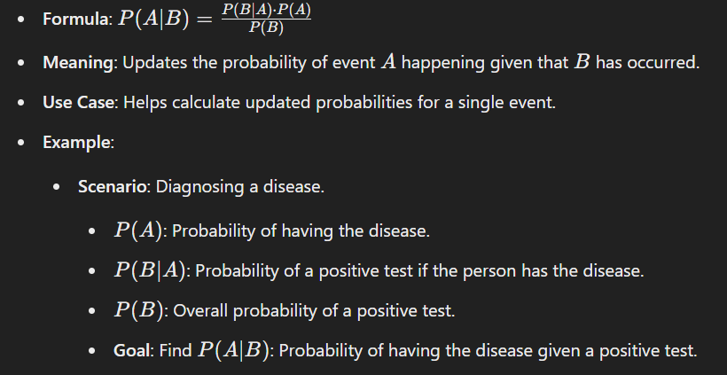

## Bayes' Theorem

## Bayesian Posterior Formula

Formula: 

**`Posterior = Prior × Likelihood`**

**Meaning**: Combines prior beliefs with new data to compute the posterior distribution.

**Use Case**: Updates beliefs iteratively over a range of possible outcomes.

Example:

`Scenario`: Estimating the probability of a coin being fair (p) after multiple tosses.
`Prior`: Initial belief about p (e.g., uniform distribution).
`Likelihood`: How well each p explains the observed data.
`Posterior`: Belief shall updated about p after seeing prior belief against the data(evidence/likelihood).

### Key Difference:

**`Bayes' Theorem`**: Focuses on a single event probability.
**`Bayesian Posterior`**: Focuses on a range of possible outcomes, combining prior and likelihood for continuous updates.

### Real-Time Example (Simplified):

**`Bayes' Theorem`**: After a COVID test, what's the probability of having COVID given a positive test result?
**`Bayesian Posterior`**: After multiple test results, update your belief about how likely it is to have COVID based on all test outcomes.