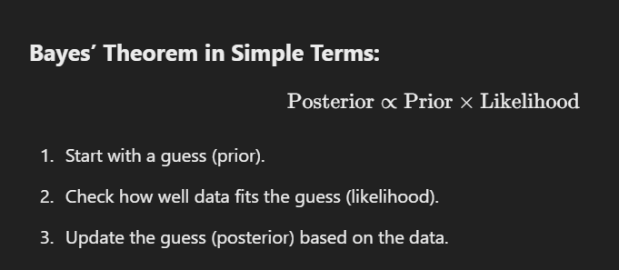
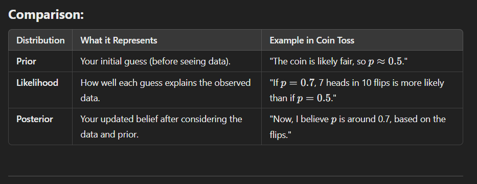

## Bayesian Models:

Bayesian models use Bayes' Theorem to update our beliefs about a parameter based on observed data. These models incorporate both prior knowledge and new evidence.

## Key Concepts:

### Prior:

- Represents our belief about a parameter before observing data.
- Example: "I believe the average height is around 5.5 feet with some uncertainty."

### Likelihood:

- Describes how likely the observed data is, given a specific value of the parameter.
- Example: "If the average height were 5.5 feet, how likely is it to see the given dataset?"

### Posterior Distribution:

- Combines the prior and likelihood to update our belief after observing data.
- Example: "Given my prior belief and the data, what is now my updated belief about the average height?"

## Steps

`Prior → Likelihood → Posterior`

- **Prior**: Start with your initial belief about the parameter.
- **Likelihood**: Use the data to calculate how consistent it is with different parameter values.
- **Posterior**: Update the prior using the likelihood (via Bayes' Theorem) to get the posterior, which reflects your updated belief.

## Scenario: Coin Toss Experiment

You find a coin, and you suspect it might not be fair. You want to figure out the probability of getting heads (p).

### 1. Prior Distribution – Your Initial Belief

Before flipping the coin, you have an opinion about p (the probability of heads):

You assume the coin is likely fair, so p is probably near 0.5, but you’re open to other possibilities.
This belief is captured in a prior distribution, e.g., a Uniform distribution over p (all values between 0 and 1 are equally likely).

In Simple Terms:
The prior reflects your initial guess, before seeing any data.

### 2. Likelihood – Evidence from Data

Now you flip the coin 10 times and get 7 heads and 3 tails. This is your data.

The likelihood quantifies how likely this data is, given different possible values of p.

Example: If p=0.5, getting 7 heads in 10 tosses is possible but not very common.

If p=0.7, the data seems more likely.

In Simple Terms:
The likelihood tells you how well each possible p explains the observed data.

### 3. Posterior Distribution – Updated Belief

After flipping the coin and seeing the data, you combine:

Your prior belief (what you thought before the data)
The likelihood (how well different p values explain the data)
This results in the posterior distribution:

It shows your updated belief about p, after considering the data.

In Simple Terms:
The posterior tells you what you now believe about p, given both your initial guess and the evidence.

### Realtime Example:

Imagine you're cooking pasta and unsure how much salt to add:

- `Prior`: You think it usually needs about 1 teaspoon of salt (initial belief).
- `Likelihood`: You taste it after adding salt. If it’s too bland, you consider adding more (data).
- `Posterior`: Based on your initial guess and tasting (evidence), you conclude it probably needs 1.5 teaspoons.