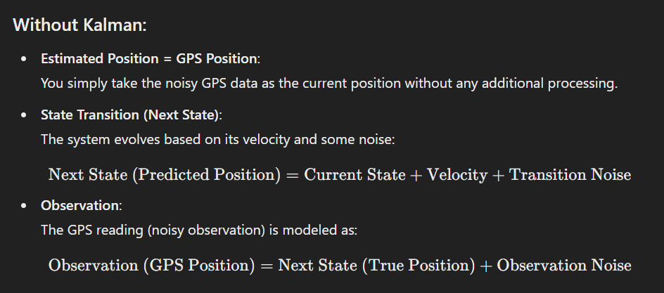
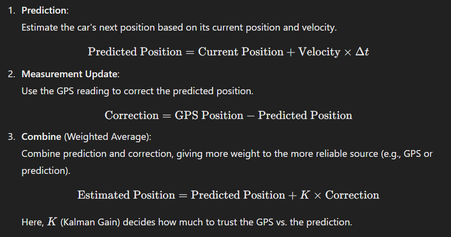
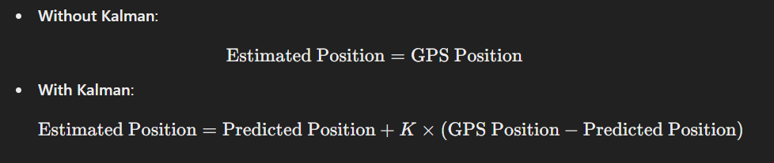
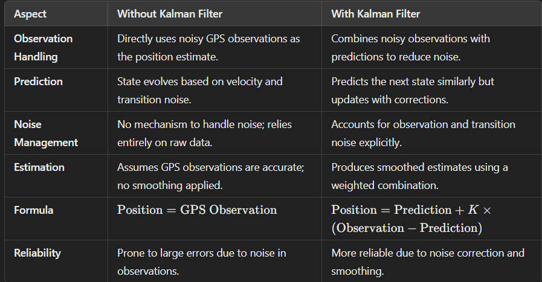

# What and Why State-Space Model are Important:

SSMs help estimate hidden true states (e.g., car position) from noisy observations, making them crucial in control systems, robotics, and financial modeling. 

>Note: State Space Models use a formula for state transitions, and Kalman Filters are used to smooth and refine the estimate of expected future movements, handling noise for a more accurate prediction.

Use cases include:

- `Self-driving cars`: Tracking vehicles and pedestrians.
- `Weather forecasting`: Estimating future climate states.
- `Economics`: Modeling market trends.

## Without Kalman Filter

### Real-Time Example: Tracking a Moving Car

Key Terms:

- **State Transition**: The car's true position evolves over time, e.g., position(t+1) = position(t) + speed + noise.

- **Observation Model**: GPS measures the car's position but includes noise.

- **True State**: The actual position of the car (unknown but estimated).

- **Next State**: The predicted position of the car based on the model.

- **Observation**: The noisy GPS reading of the car’s position.

### Pseudo Algorithm: Car Tracking Using State-Space Model

1. **Initialize Parameters**:

- Set initial position (true_state[0]).
- Define constants like velocity, transition noise, and observation noise.

2. **For each time step (from 1 to total steps)**:

- State Transition:
    - Compute the next true position:
    `next_state = current_state + velocity + transition_noise`
    - Append next_state to true_state.
- Observation Model:
    - Simulate noisy measurement:
    `observation = next_state + observation_noise`
    - Store observation.

3. **Output Results**:

- Return the list of true_state and observations.

4. **Optional Visualization**:

- Plot true_state (actual positions).
- Plot observations (noisy GPS readings).

**Key Notes**:

- The algorithm predicts the system's evolution (state transition) and generates noisy observations to mimic real-world measurements.
Adjusting noise parameters or adding Bayesian inference can refine the accuracy of predictions.

### State Transitions, Observations in short:

**`Extrapolation`**: Using the true position and state transition formula, we predict the next state and add noise to simulate real-world uncertainty.

**`Observations`**: Represent noisy measurements (e.g., GPS) around the predicted state(which comes from state transition).

**`Inference`**: By combining predictions and noisy observations, we estimate the future behavior of the system. This is state transition prediction + uncertainity observations around it.

>Note: If the true position or state transition formula is inaccurate or poorly designed, predictions and observations will deviate significantly from reality, leading to erroneous inferences. This highlights the importance of accurately modeling both the state evolution and observation processes for reliable predictions.

>Note: Without the Kalman Filter, the state space prediction would be a more basic, unsmoothed estimate directly based on GPS observations, without handling noise or updating dynamically.

>Note: Bayesian posterior inference can estimate state transition parameters and observation noise by updating beliefs about these parameters based on observed data. This helps refine the model for more accurate predictions and state estimations.

## With Kalman Filter

- Imagine you're tracking a car's position on a straight road using a noisy GPS. The GPS gives you a position every second, but the values have random errors.

- **Without Kalman Filter**:

    - You take the GPS position as it is, assuming it’s accurate.

    - Formula: ``Estimated Position = GPS Position``

    - Problem: Since GPS data is noisy, the position will jump around unpredictably.

- **With Kalman Filter**:

    - The Kalman filter smooths out the noise by combining the GPS data with predictions based on the car’s motion (velocity and previous position).

    - It predicts where the car should be and corrects this prediction using the GPS data.

    - Formula (simplified):``Estimated Position = Predicted Position + Correction``

### Pseudo Algorithm: Car Tracking Using State-Space Model

Steps in a Kalman Filter (Simplified):

>Note: ``GPS Position = next_state + observation_noise``

>Note: ``Observation = GPS Position``, and ``Predicted Position = Next State`` is correct in short. In Kalman filters, these two are combined to estimate the position more accurately.

### Key Difference in Formulas:

### Why Kalman Filter Is Better:

- **Without a Kalman filter**, you’re entirely dependent on noisy GPS data.
- **With a Kalman filter**, you smooth out noise by incorporating both motion predictions and measurements, making the position estimate more accurate and stable.

>Note: The Kalman Filter estimate is a smoother, noise-handled version of the GPS observations and predicted next state, combining both to produce a more accurate and stable position estimate.

