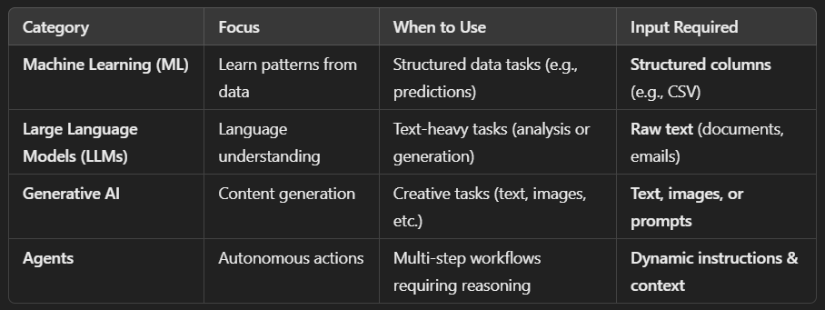

# <span style='color:steelblue'> Data Science</span>

Data science is the field of study that uses scientific methods, algorithms, and systems to extract knowledge and insights from structured and unstructured data, enabling informed decision-making and predictive analysis across various domains.

## ML (vs) LLM (vs) Generative AI (vs) AI Agents



## Statistics

### Mean

Mean is the average of a data set.

```text
Mean = (x1+x2+..xn) / (n) 
     = (Total number of numbers) / (Sum of all the numbers)
     = 2 + 4 + 6 + 8 / 4 => 5 
```

### Mode

It is a measure to find central tendency just like mean, but instead of avg. it focus on most frequently occuring value.

```text
Mode = {2, 3, 4, 4, 4, 5, 6} => 4
```

### Median

It is another measure to find central tendency just like mean & mode, but instead of avg. or most frequent value, it focuses on middle value in the dataset.

```text
If data set length is odd => value at x((n+1)/2)  

data set = {1, 3, 4, 6, 8}; length = 5

Median => x((5+1)/2) => x(6/2) => x(3) => 4

If data set length is even => (value at x(n/2) + value at x(n/2 + 1)) / 2

data set = {2, 4, 6, 8}; length = 4

Median => (value at x(4/2) + value at x(4/2 + 1)) / 2 => (x(2) + x(3)) / 2 => (4+6) / 2 => 5
```

### Standard Deviation

The standard deviation measures the amount of variation or dispersion in a set of values. It tells you how spread out the values are from the mean.

```text
Standard Deviation => sqrt(sum i->n (square(xi-𝑥ˉ)) / n-1)

xi: represents each individual value in the dataset.
𝑥ˉ: represents the mean (average) of the dataset.
𝑛: represents the total number of values in the dataset.

Steps:
1. Find the mean i.e., 𝑥ˉ of the dataset.
2. Subtract the mean from each individual value to get the deviation from the mean for each value.
3. Square each deviation to eliminate negative values and emphasize differences from the mean.
4. Find the average of these squared deviations.
5. Take the square root of this average to get the standard deviation.

Note: 
1. It's a way to measure the average distance of each data point from the mean, but now in the original units of the data. As square and square root get cancelled. So it becomes overall average
2. A low standard deviation indicates that the values tend to be close to the mean (also called the expected value) of the set, while a high standard deviation indicates that the values are spread out over a wider range.
```

### Variance

Variance is a measure of how much the values in a dataset differ from the mean. It quantifies the dispersion or spread of the data points.

```text
Standard Deviation => sum i->n (square(xi-𝑥ˉ)) / n-1

xi: represents each individual value in the dataset.
𝑥ˉ: represents the mean (average) of the dataset.
𝑛: represents the total number of values in the dataset.

Steps:
1. Find the mean i.e., 𝑥ˉ of the dataset.
2. Subtract the mean from each individual value to get the deviation from the mean for each value.
3. Square each deviation to eliminate negative values and emphasize differences from the mean.
4. Find the average of these squared deviations.

Note: 
1. Since variance is in squared units i.e., squared average, its interpretation might not be as intuitive as standard deviation (which is like original units as we cancelled sqrt and sqaure. so it becomes overall average).
2. A larger variance indicates that the data points are more spread out from the mean, while a smaller variance indicates that the data points are closer to the mean.
```

### Covariance

Covariance measures how much two variables change together. It tells you whether the variables tend to increase or decrease at the same time. Here's a simpler breakdown:

```text
Positive Covariance: If one variable tends to increase as the other increases, the covariance is positive.

Negative Covariance: If one variable tends to decrease as the other increases, the covariance is negative.

Zero Covariance: If there's no clear trend in how the variables change together, the covariance is close to zero.

Covariance is a bit trickier to interpret because it depends on the scale of the variables. If the variables are in different units or have different ranges, it might be hard to compare covariances directly.

Cov(X,Y) => sum i->n ((xi-𝑥ˉ)(yi-yˉ)) / (n-1)

xi = represents each individual value of variable 𝑋
𝑦𝑖 = represents each individual value of variable Y 
𝑥ˉ = represents the mean (average) of variable 𝑋
𝑦ˉ = represents the mean (average) of variable 𝑌
n = represents the total number of observations (values) for both variables.

Divide the sum by 𝑛−1, where n is the number of observations. This is because we are estimating the population covariance from a sample, so we use n−1 instead of 𝑛 to provide an unbiased estimate.
```

### Correlation

Correlation is a measure of the relationship between two variables. It tells you how much and in what direction they are related. Here's a simpler explanation:

```text
Positive Correlation: When one variable increases, the other tends to increase as well. It's like saying they move in the same direction.

Negative Correlation: When one variable increases, the other tends to decrease. They move in opposite directions.

No Correlation: When there's no clear trend in how the variables relate to each other. Changes in one variable don't predict changes in the other.

Correlation is a more standardized measure compared to covariance. It's expressed as a value between -1 and 1, where:

* 1 means perfect positive correlation,
* -1 means perfect negative correlation, and
* 0 means no correlation.

Correlation helps you understand how changes in one variable might affect the other, and it's easier to compare across different datasets because it's not affected by the scale of the variables.

Corr(X,Y) = Cov(X,Y) / (σX × σY)
​
Corr(X,Y) represents the correlation coefficient between variables X and 𝑌.
Cov(X,Y) represents the covariance coefficient between variables X and 𝑌.
σX represents the standard deviation of variable X.
σY represents the standard deviation of variable Y.
```

### Hypothesis Testing

In hypothesis testing for model parameter selection, the null hypothesis (H0) typically states that there is no significant relationship between the independent variable(s) and the dependent variable.

Let's say you're testing the effect of studying hours (independent variable) on exam scores (dependent variable). Your null hypothesis (𝐻0) could be: "There is no significant relationship between studying hours and exam scores."

Now, let's assume you've conducted a hypothesis test and obtained a p-value of 0.03. This means that there is only a 3% probability of observing the data or something more extreme if the null hypothesis were true.

To interpret this result:

If p_val<α, where α is your chosen significance level (commonly 0.05), you reject the null hypothesis. In our example, since p_val=0.03<0.05, you would reject the null hypothesis.
If p_val≥α, you fail to reject the null hypothesis.

Null Hypothesis (𝐻0): 𝐻0 assumes that there is no effect or relationship between the variables.
Alternative Hypothesis (𝐻𝑎): 𝐻𝑎 suggests that there is a significant effect or relationship.
Significance Level (α) [Rejection region in normla distribution]: This is the probability threshold for rejecting the null hypothesis. Commonly chosen values are 0.05 (5%) or 0.01 (1%).
P-value (p_val): This is the probability of observing the actual data or something more extreme if the null hypothesis were true.
Decision Rule: If p_val<α, you reject 𝐻0; otherwise, you fail to reject H0.

In simpler words `there is only 3% probability that studying hours has no effect on exam scores which is less than rejection region limit meanining it enters into extreme cases region, so in other terms says most of the time study hours have effect on exam score, so we reject null hypothesis and accept alternative hypothesis, saying this is significant variable[study hours] for predicting dependent variable[exam scores]`.

In mathematical terms, the p-value is obtained from the test statistic (e.g., t-statistic for t-tests, F-statistic for ANOVA) using the probability distribution associated with the test. If the p-value is smaller than α, it suggests that the observed effect is statistically significant, and you reject the null hypothesis in favor of the alternative hypothesis.

This approach helps in model parameter selection by determining which variables have a significant impact on the dependent variable, allowing you to build a more accurate predictive model.

### T-Tests

A t-test is a statistical test used to determine if there is a significant difference between the means of two groups.

Assumptions:

Normality: The data within each group should be approximately normally distributed. However, t-tests are relatively robust to violations of normality, especially with larger sample sizes.
Independence: The observations within each group should be independent of each other. This means that the values in one group should not be influenced by the values in another group.
Homogeneity of Variance: The variances of the groups being compared should be roughly equal. Violations of this assumption can affect the accuracy of the t-test results, particularly if the sample sizes are unequal.

General Use Case:

Comparing means of two groups: For example, you might use a t-test to compare the mean exam scores of two different teaching methods to see if one method leads to significantly higher scores than the other.

Testing before and after: You could also use a t-test to compare the mean performance of students before and after receiving a tutoring intervention to determine if there's a significant improvement.

Summary:

Used for comparing means between two groups.

### ANOVA (Analysis of Variance)

ANOVA is a statistical technique used to determine if there are significant differences in the means of three or more groups.

General Use Case:

Comparing means of multiple groups: For example, you might use ANOVA to compare the mean scores of students across different schools to see if there's a significant difference in performance.

Experimental designs: ANOVA is commonly used in experimental designs with multiple treatment groups. For instance, in drug trials, you might have several groups receiving different doses of a medication, and ANOVA helps determine if there are significant differences in the treatment effects.

Assumptions:

Normality: Similar to t-tests, the data within each group should be approximately normally distributed.
Independence: The observations within each group should be independent of each other.
Homogeneity of Variance: The variances of the groups being compared should be roughly equal. This assumption is crucial for the accuracy of ANOVA results, particularly when the sample sizes are unequal.
Independence of Observations: The observations across groups should be independent of each other. In other words, there should be no systematic relationship between observations in different groups.

Key Differences

T-tests compare the means of two groups, while ANOVA compares the means of three or more groups. T-tests are typically used when comparing means between two groups, whereas ANOVA is used when comparing means across multiple groups.

Summary:

Used for comparing means across three or more groups.

Both t-tests and ANOVA help researchers determine if observed differences between groups are due to actual effects or random chance, allowing for informed decision-making in various research contexts.

### T-Statistic for Testing Individual Coefficients in Linear Regression

In linear regression, the t-statistic is commonly used to test the significance of individual coefficients (regression parameters) associated with independent variables.

The t-statistic measures the significance of each coefficient estimate by comparing it to a standard error. It indicates whether the coefficient is significantly different from zero, suggesting a non-zero effect of the corresponding independent variable on the dependent variable.

t = β^i / SE (β^i)
β^i is the estimated coefficient for the independent variable 𝑥𝑖,
SE(β^i) is the standard error of the estimated coefficient.

If the absolute value of the t-statistic for a coefficient is greater than the critical value (i.e., falls under critical region => < 0.05) corresponding to the desired level of significance (e.g., 0.05), the coefficient is considered statistically significant.


### F-Statistic(ANOVA) for Testing Overall Significance in Linear Regression

The F-statistic in linear regression is used to test the overall significance of the model, i.e., whether at least one of the independent variables has a non-zero effect on the dependent variable.

The F-statistic evaluates whether the regression model as a whole is significant by comparing the overall variability explained by the model to the variability not explained by the model.

F = (SSR/p) / (SSE/(n-p-1))

SSR is the regression sum of squares, which measures the variability explained by the model,
SSE is the error sum of squares, which measures the unexplained variability,
p is the number of coefficients (including the intercept) being estimated in the model,
n is the number of observations.

If the F-statistic is greater than the critical value corresponding to the desired level of significance, the regression model is considered statistically significant as a whole.

These statistics help assess the importance of individual predictors and the overall fit of the model, aiding in model selection and interpretation.